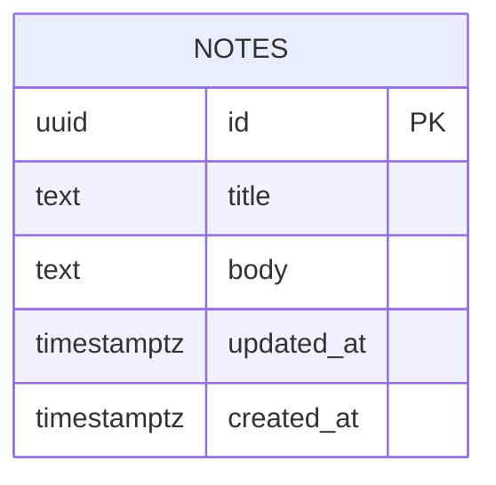

# Database Design (ERD) — Note Board

Engine: PostgreSQL 16
Last updated: 2026-08-14
Source requirements: `docs/notes/SRS.md`

## 1. Overview

This schema stores saved notes for “Note Board”. `notes` is the only aggregate root because product scope is one read-only list of existing notes. Authentication, note management, search, tags, pagination, audit history, and profile data are deliberately outside database scope for this release.

## 2. Diagram

Cardinality notation: `||` exactly one, `o|` zero or one, `}o` zero or many,
`}|` one or many. Read left to right. This release has no inter-table relationships.

## 3. Entities

### 3.1 `notes`

**Purpose** — Stores saved note content that visitors read on one board. **Traces to** — NOTES-001, NOTES-002, NOTES-003, NOTES-004.

| Column | Type | Null | Default | Unique | Description |
|---|---|---|---|---|---|
| `id` | `uuid` | no | `gen_random_uuid()` | PK | Surrogate key for stable API identity |
| `title` | `text` | yes | none | no | Optional note title shown when present |
| `body` | `text` | yes | none | no | Optional note body or excerpt shown when present |
| `updated_at` | `timestamptz` | yes | none | no | Optional last-updated instant formatted by UI as `Updated Mon DD, YYYY` |
| `created_at` | `timestamptz` | no | `now()` | no | Row creation timestamp, UTC |

**Nullable columns**

- `title` — SRS allows missing title; UI shows safe untitled label instead of blank heading.
- `body` — SRS allows missing body; UI omits body text.
- `updated_at` — SRS allows missing updated date; UI omits date text.

**Foreign keys**

| Column | References | On delete | On update | Why |
|---|---|---|---|---|
| none | none | n/a | n/a | No parent entities exist in scope |

**Constraints**

- `ck_notes_title_not_blank` — `title IS NULL OR btrim(title) <> ''`; prevents blank title values that are distinct from missing title.
- `ck_notes_body_not_blank` — `body IS NULL OR btrim(body) <> ''`; prevents blank body values that are distinct from missing body.

**Indexes**

| Name | Columns | Type | Query it serves |
|---|---|---|---|
| `idx_notes_updated_at_id` | `updated_at DESC NULLS LAST, id ASC` | btree | List all notes in stable updated-date order for `GET /notes` |

**Lifecycle** — hard delete only. Product has no delete operation; rows may be inserted or maintained outside this product scope. No soft delete because SRS has no audit, restore, or retention requirement and every product read should show stored notes.

## 4. Enumerations

No enumerations. Notes have no status, category, or type in SRS scope.

| Name | Values | Mechanism | Why |
|---|---|---|---|
| none | none | none | No fixed-value fields exist |

## 5. Access patterns

| # | Pattern | Frequency | Index used |
|---|---|---|---|
| 1 | Fetch every saved note for read-only board, ordered by `updated_at DESC NULLS LAST, id ASC` | Every page load and retry | `idx_notes_updated_at_id` |

No pagination index beyond list order because SRS says render all returned notes for initial release. Revisit if note count grows enough to require pagination.

## 6. Data volume and growth

| Table | Rows at launch | Growth | Retention |
|---|---|---|---|
| `notes` | Existing saved notes, expected small | Maintained outside product scope | Until removed by out-of-scope maintenance |

No table is expected to exceed 10M rows within one year for this release. No partitioning or archival needed.

## 7. Integrity, privacy, and security

- Database enforces stable note identity, non-blank optional text when present, creation timestamp, and list-order index. Application enforces safe display fallbacks for missing or malformed values because SRS makes those presentation rules.
- `title` and `body` may contain saved note content visible to every visitor. No authentication or row-level access rule exists because SRS says all visitors may view all saved notes.
- No columns hold secrets, credentials, passwords, tokens, payment data, or profile data.
- No row-level security for initial release; all rows are public within product boundary.

## 8. Migrations

| # | Change | Forward | Backward | Safe on non-empty table |
|---|---|---|---|---|
| 1 | Enable UUID generation | `CREATE EXTENSION IF NOT EXISTS pgcrypto;` | no-op or leave extension installed | yes; extension add is metadata-level and shared-safe |
| 2 | Initial notes schema | `CREATE TABLE notes (...); CREATE INDEX idx_notes_updated_at_id ...;` | `DROP TABLE IF EXISTS notes;` | n/a for first deploy; unsafe backward if table contains product data because dropping table deletes notes |

Forward migration creates `notes` with UUID primary key, nullable `title`, nullable `body`, nullable `updated_at`, non-null `created_at`, check constraints, and list-order index.

Backward migration drops `notes`. This is destructive if rows exist; acceptable only for local rollback before product data is loaded. Production rollback must restore from backup if data exists.

## 9. Open questions

| Question | Owner | Blocking |
|---|---|---|
| none | n/a | no |
