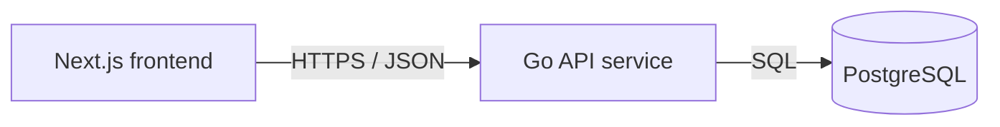

# Service & Interface Design — Note Board

Last updated: 2026-08-14
Source: `docs/notes/SRS.md`, `docs/architecture/erd.md`

## 1. Service map



| Service | Responsibility | Owns (tables) | Depends on | Deploy unit |
|---|---|---|---|---|
| Go API service | Serve read-only notes API and health checks; apply DB migrations before listening. | `notes` | PostgreSQL | `code/backend` container |
| Next.js frontend | Render “Note Board” page states and fetch saved notes through API only. | none | Go API service | `code/frontend` container |
| PostgreSQL | Persist saved notes. | physical storage for `notes`; logical owner is Go API service | none | database container / managed database |

**Why these boundaries** — single backend service: no extra service boundary justified yet. Frontend, API, and database differ by deploy unit and runtime concern; only API owns table writes and reads. Frontend never reaches database directly.

## 2. Cross-cutting contract

### 2.1 Base

- Base URL: `{scheme}://{host}/api/v1`
- Content type: `application/json; charset=utf-8`
- Versioning: URL path major version. A new major version only for breaking changes.
- Trace header: `X-Request-Id` accepted from caller, generated if absent, echoed on every response and present in every log line.
- JSON naming: `snake_case`.
- Timestamp format: RFC 3339 UTC on wire. UI formats `updated_at` as `Updated Mon DD, YYYY`.

### 2.2 Authentication and authorization

| Aspect | Decision |
|---|---|
| Mechanism | none |
| Token lifetime | n/a |
| Refresh | n/a |
| Transport | no `Authorization` header required or used |
| Roles | Visitor only; every visitor may read all saved notes |
| Enforcement point | endpoint handler rejects no visitor; DB access stays server-side only |

### 2.3 Error contract

Every non-2xx response, from every endpoint, has this shape:

```json
{
  "error": {
    "code": "VALIDATION_FAILED",
    "message": "Human-readable summary, safe to show a user.",
    "details": [
      { "field": "limit", "code": "OUT_OF_RANGE", "message": "Limit must be between 1 and 200." }
    ],
    "request_id": "01HX..."
  }
}
```

Consumers branch on `code`. `message` is display text and may be reworded at any time without notice; it is not part of the contract. `details` is present only when field-level validation details exist. Error messages never expose SQL, stack traces, file paths, DSNs, internal hostnames, or raw dependency errors.

**Error catalog** — full closed set for this project.

| Code | HTTP | Meaning | Retryable |
|---|---|---|---|
| `BAD_REQUEST` | 400 | Malformed request, invalid query type, bad cursor encoding, unsupported content type, or body sent where none is allowed | no |
| `VALIDATION_FAILED` | 422 | Well-formed request failed semantic validation | no |
| `RATE_LIMITED` | 429 | Too many requests; honor `Retry-After` | yes |
| `INTERNAL` | 500 | Unexpected failure; details are logged with `request_id`, not returned | yes |
| `UNAVAILABLE` | 503 | Database unavailable, migration not ready, timeout, or service shutting down | yes |

### 2.4 Pagination

One project-wide scheme exists, though initial UI uses defaults and shows one returned list without pagination controls.

```
GET /api/v1/notes?limit=50&cursor=eyJ1cGRhdGVkX2F0IjoiMjAyNi0wOC0xNFQwMDowMDowMFoiLCJpZCI6IjAxOTFiZDMwLTQyN2ItN2JjYS1hODAyLTU5YWE2NzMyMGNiMSJ9
```

```json
{
  "notes": [
    {
      "id": "0191bd30-427b-7bca-a802-59aa67320cb1",
      "title": "Release checklist",
      "body": "Confirm deploy window and rollback note.",
      "updated_at": "2026-08-14T10:04:18Z"
    }
  ],
  "next_cursor": null,
  "has_more": false
}
```

| Aspect | Decision |
|---|---|
| Style | cursor |
| Default limit | 200 |
| Max limit | 200 |
| Default sort | `updated_at DESC NULLS LAST, id ASC`; stable and unique by `id` tiebreaker |
| Cursor contents | opaque base64url JSON containing `updated_at` and `id`; clients must not parse it |

Why cursor: notes can be maintained outside this product while visitors read. Cursor pagination avoids duplicates/skips if row count later grows. Initial product may return all notes up to max default; no pagination UI appears.

### 2.5 Validation boundary

Validation boundary is Go API HTTP handler layer, before repository/database calls. It validates method, path, query parameter names, query types, `limit` range, cursor decoding, request body absence, and `Content-Type` when body is present. Downstream repository code may trust validated inputs and must use parameterized SQL.

### 2.6 Idempotency

No write endpoints exist. `Idempotency-Key` is not accepted by any endpoint. Replays of `GET` are naturally idempotent and never mutate data.

## 3. Endpoints

### 3.1 `GET /api/v1/notes`

**Purpose** — Fetch saved notes for read-only board. **Traces to** — NOTES-001, NOTES-002, NOTES-003, NOTES-004. **Auth** — none; Visitor access.

**Path / query parameters**

| Name | In | Type | Required | Constraints | Description |
|---|---|---|---|---|---|
| `limit` | query | integer | no | `1 <= limit <= 200`; default `200`; reject non-integer instead of coercing | Maximum notes to return. Frontend omits it for initial release. |
| `cursor` | query | string | no | opaque cursor previously returned by this endpoint; base64url; max 512 chars | Return notes after cursor in default sort order. Frontend omits it for initial release. |

Unknown query parameters are rejected with `BAD_REQUEST` to keep contract closed.

**Request body**

No request body. Any non-empty request body returns `BAD_REQUEST`.

| Field | Type | Required | Constraints | Description |
|---|---|---|---|---|
| none | n/a | n/a | n/a | GET has no body |

**Success response** — `200`

```json
{
  "notes": [
    {
      "id": "0191bd30-427b-7bca-a802-59aa67320cb1",
      "title": "Release checklist",
      "body": "Confirm deploy window and rollback note.",
      "updated_at": "2026-08-14T10:04:18Z"
    },
    {
      "id": "0191bd30-427b-7bca-a802-59aa67320cb2",
      "title": null,
      "body": null,
      "updated_at": null
    }
  ],
  "next_cursor": null,
  "has_more": false
}
```

| Field | Type | Nullable | Description |
|---|---|---|---|
| `notes` | array of note objects | no | Saved notes in default order. Empty array means empty state. |
| `notes[].id` | string uuid | no | Stable note identity. |
| `notes[].title` | string | yes | Optional title. `null` means UI displays safe untitled label. Blank strings are never returned because DB constraint rejects them. |
| `notes[].body` | string | yes | Optional body/excerpt source. `null` means UI omits body text. Blank strings are never returned because DB constraint rejects them. |
| `notes[].updated_at` | string RFC 3339 UTC | yes | Optional update instant. `null` means UI omits date text. UI omits date if formatting fails. |
| `next_cursor` | string | yes | Cursor for next page when `has_more` is true; `null` otherwise. |
| `has_more` | boolean | no | Whether another page exists. Initial UI ignores it because no pagination controls are in scope. |

**Errors** — every code this endpoint can return. No others.

| Code | HTTP | Trigger |
|---|---|---|
| `BAD_REQUEST` | 400 | Unsupported method, unknown query parameter, non-integer `limit`, malformed cursor, cursor over 512 chars, unsupported `Content-Type`, or non-empty body |
| `VALIDATION_FAILED` | 422 | `limit` outside `1..200` or decoded cursor shape invalid |
| `RATE_LIMITED` | 429 | Caller exceeds project read limit |
| `INTERNAL` | 500 | Unexpected server error after request validation |
| `UNAVAILABLE` | 503 | PostgreSQL unavailable, query timeout, service draining, or migrations not ready |

**Notes** — no side effects. No idempotency key. Rate limit: 120 requests per IP per minute. Read query timeout: 2 seconds. Ordering guarantee: `updated_at DESC NULLS LAST, id ASC`; notes with missing `updated_at` come last. Endpoint may return zero notes with `200`, not `404`. Frontend retry calls same endpoint again; it does not create, edit, or delete notes.

## 4. Asynchronous work

No jobs, queues, schedules, or events exist in this release.

| Name | Trigger | Payload | Retry | Backoff | Dead letter | Idempotent |
|---|---|---|---|---|---|---|
| none | none | none | none | none | none | n/a |

## 5. External integrations

No third-party integrations exist. No external secrets or provider setup required.

| System | Purpose | Protocol | Timeout | Retry | On failure | Secrets |
|---|---|---|---|---|---|---|
| PostgreSQL | Read saved notes | SQL over driver connection | 2s query timeout | no automatic retry inside request | API returns `UNAVAILABLE`; UI shows safe error state with retry action | `DATABASE_URL` environment variable |

Cross-service calls:

| Caller | Callee | Mode | Timeout | Retry policy | Idempotency key | On failure |
|---|---|---|---|---|---|---|
| Next.js frontend | Go API `GET /api/v1/notes` | synchronous HTTPS/JSON | 5s client fetch timeout | no automatic loop; only user-triggered retry from error state | none; GET is idempotent | UI shows safe error state with retry action and no internal details |
| Go API service | PostgreSQL | synchronous SQL | 2s query timeout | no retry inside request; fail fast | none; read-only | API returns `UNAVAILABLE` with request id; logs dependency error internally |

## 6. Non-functional targets

| Aspect | Target |
|---|---|
| p95 latency (read) | API `GET /api/v1/notes` under 500ms for up to 200 notes, excluding network |
| p95 latency (write) | n/a; no write endpoints |
| Availability | Serve error contract whenever API is reachable; `/healthz` stays unhealthy until DB migrations and ping pass |
| Rate limit | 120 read requests per IP per minute; 429 includes `Retry-After` |
| Payload cap | Response target under 1 MB; request body cap 0 bytes for `GET /api/v1/notes` |
| Timeout (inbound) | 10s server read/write timeout; 2s DB query timeout |

## 7. Observability

- Log fields present on every request line: `request_id`, method, path, status, duration_ms, remote_addr hash, user_agent hash, error_code when non-2xx.
- Metrics per endpoint: request count, error count by `error.code`, duration histogram, DB query duration, rate-limit count.
- Never logged: `DATABASE_URL`, credentials, full note `title`, full note `body`, full request bodies, raw SQL with values, stack traces in response.

## 8. Contract evolution

| Change | Additive or breaking | Migration path |
|---|---|---|
| Add optional response field to `notes[]` | additive | Clients ignore unknown fields. |
| Add optional query parameter with same default behavior when omitted | additive | Document parameter; existing clients unchanged. |
| Add new endpoint under `/api/v1` | additive | No migration needed. |
| Rename/remove response field, change field type, change default sort, change default/max limit, or alter error status mapping | breaking | Add `/api/v2`, keep `/api/v1` until frontend migrates, then deprecate with `Deprecation` header and removal date. |
| Add authentication requirement to notes list | breaking | New product scope; ship auth flow and `/api/v2/notes`, keep public `/api/v1/notes` until migration date if privacy allows. |

## 9. Requirement traceability

| SRS requirement | Contract coverage |
|---|---|
| NOTES-001 Show saved notes list | `GET /api/v1/notes` returns `notes[]` with `title`, `body`, `updated_at`, stable order, no mutation endpoints. |
| NOTES-002 Show loading state | Frontend fetches `GET /api/v1/notes`; unresolved promise is UI loading state. |
| NOTES-003 Show empty state | `GET /api/v1/notes` returns `200` with `notes: []`. |
| NOTES-004 Show error state with retry | Endpoint enumerates retryable `RATE_LIMITED`, `INTERNAL`, `UNAVAILABLE`; frontend failure behavior is safe error state with user retry. |

## 10. Open questions

| Question | Owner | Blocking |
|---|---|---|
| none | n/a | no |
